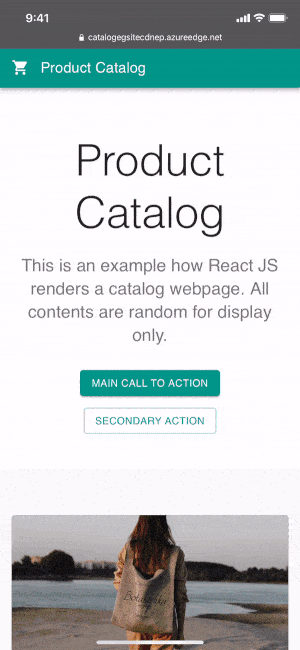
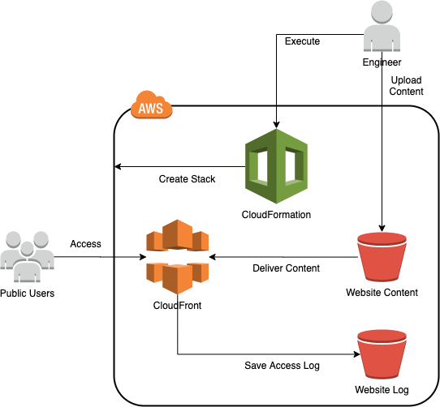
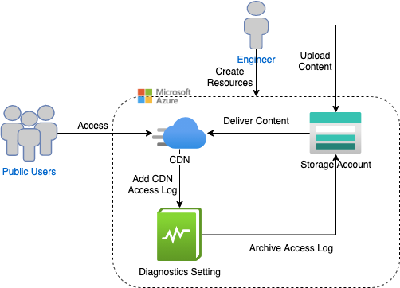
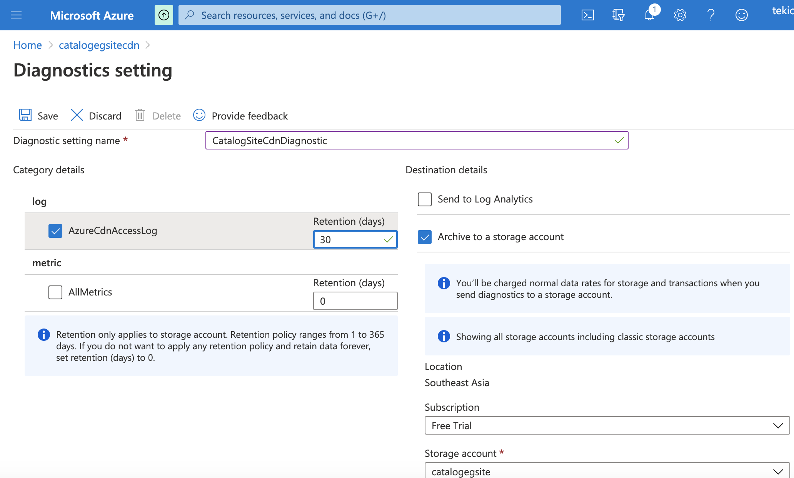

# Catalog Example

This repository is an example how AWS S3 and Azure Storage provide static website hosting service. You could follow the listed steps to host the example website in AWS and Azure respectively.
[](/LICENSE)

AWS and Azure both provide website hosting feature in their storage services. Such feature is considered as a managed service of website hosting so that the website owners can transfer some infrastructure workload, such as hardware maintenance and sizing, to the cloud providers. The costing is so flexible with minimal upfront. This solution is suitable for typical static websites and even Single Page Applications in which traffic volumes and peaks are often highly variable and fluctuating.

Both platforms provide CLI method to automate the deployment, in addition to web portal. This automation approach is useful for large scale of deployment, governance and integration in CI/CD. This below section will instruct how to run CLI to build the resource stack accordingly. The pricing is also described to demonstrate the cost efficiency.



*The example website is a product catalog built by React JS. The detail will not be covered here. Setups of domain name, DNS and secure connection (https) are out of scope in this document.*

### Folder Structure
- **build**: the production version of website files. It is built by `npm`. (not saved in this repository, refer to the Appendix)
- **doc**: document files used by README
- **public**: static webpage template by React JS
- **scripts**: infrastruture setup scripts
- **src**: React JS source codes


## Table of Contents 
- [AWS S3](#aws-s3)  
- [Azure Storage](#azure-storage)
- [Appendix](#appendix)


<a name="aws-s3"></a>

## AWS S3



This approach is to utilize CloudFront as a HTTPS access point to the public. CloudFront delivers the content from an S3 bucket. CloudFront stores access logs to another S3 bucket for monitoring. The whole setup is implemented by CloudFormation.

*Before you start, create an IAM user credentials with sufficient priviledges to execute `aws` CLI.*

1. CREATE CloudFormation Stack to create S3 Bucket

```Bash
aws cloudformation create-stack --stack-name <STACK NAME> --profile <USER PROFILE>  --template-body file://./scripts/aws_cf_s3_create_website.yaml --parameters ParameterKey=BucketNameParam,ParameterValue=<BUCKET NAME> ParameterKey=RegionCodeParam,ParameterValue=<REGION CODE>
```
- \<STACK NAME\>: The stack name of this CloudFormation Stack
- \<USER PROFILE\>: The profile name to run this command locally
- \<BUCKET NAME\>: The S3 bucket to store the website content
- \<REGION CODE\>: The region code of the S3 Bucket. The region should have been configured in the profile used above.

2. After the stack is created completely, UPLOAD website files to the S3 Bucket

Stack Status Check:
```Bash 
aws clouformation describe-stacks --stack-name <STACK NAME> --profile <USER PROFILE>
```

Upload:
```Bash
aws s3 cp ./build/ s3://<BUCKET NAME>/ --recursive --profile <USER PROFILE>
```

3. Browse the assigned domain name from CloudFront
```Bash
aws cloudfront list-distributions --query "DistributionList.Items[].DomainName" --profile <USER PROFILE>
```

4. Browse the website.
The URL of the website is in format of https://\<DOMAIN PREFIX\>.cloudfront.net. The whole domain name can be found in the above command.
- \<DOMAIN PREFIX\>: CloudFront Domain Prefix which is assigned by CloudFront automatically.

### Stack Deletion
If you would like to delete the whole stack of resources, e.g clean up or no longer use the website, you could run the command:
```Bash
aws s3 rb s3://<BUCKET NAME> --profile <USER PROFILE> --force
aws s3 rb s3://<BUCKET NAME>-log --profile <USER PROFILE> --force
aws cloudformation delete-stack --stack-name <STACK NAME> --profile <USER PROFILE>
```

### Pricing
*Assume USD in ap-southeast-1 region (Singapore) as of 1st Oct 2020*

| Service | Category | Price |
| ------- | -------- | ----- |
| CloudFormation | AWS Resources | $0 |
| S3 | Standard - First 50TB / Month | $0.025 per GB |
| S3 | Standard - PUT,COPY,POST,LIST | $0.005 per 1K requests |
| S3 | Standard - GET,SELECT | $0.0004 per 1K requests |
| S3 | Data In | $0 |
| S3 | Data Out to CloudFront | $0 |
| CloudFront | Data Out to Internet | $0.14 per GB |
| CloudFront | HTTPS requests | $0.009 per 10K requests | 

e.g. 1GB website content to serve 5M users, the monthly cost is estimated as $4.7.

<a name="azure-storage"></a>

## Azure Storage



*Before you start, create a principal with sufficient priviledges to execute `az` CLI. `az login` should have been executed successfully*

1. Create Resource Group
```Bash
az group create --location <LOCATION NAME> --name <RESOURCE GROUP>
```
- \<LOCATION NAME\>: Location Name in Azure. It can be viewed from a list of the command `az account list-locations`.
- \<RESOURCE GROUP\>: A name of the resource group we are creating to put all related resources together.

2. Create Storage Account
```Bash
az storage account create --name <STORAGE ACCOUNT> --resource-group <RESOURCE GROUP> --location <LOCATION NAME> --sku Standard_LRS
```
- \<STORAGE ACCOUNT\>: Storage Account Name to be created

3. Create $web Blob Container
```Bash
az storage container create --account-name <STORAGE ACCOUNT> --name '$web' 
```

4. Enable Website Hosting in Blob Storage
```Bash
az storage blob service-properties update --account-name <STORAGE ACCOUNT> --static-website --404-document error.html --index-document index.html
```

5. Upload website files to the $web Blob Container
```Bash
az storage blob upload-batch --account-name <STORAGE ACCOUNT> --source ./build/ --destination '$web'
```

6. Create CDN Profile
```Bash
az cdn profile create --name <CDN Profile> --resource-group <RESOURCE GROUP> --sku Standard_Microsoft
```
- \<CDN Profile\>: Name of CDN Profile

7. Create CDN Endpoint
```Bash
az cdn endpoint create --name <CDN Profile> --resource-group <RESOURCE GROUP> --profile-name <CDN Profile> --origin <HOSTING HOST> --origin-host-header catalogegsite.z23.web.core.windows.net --enable-compression
```
- \<CDN Endpoint\>: Name of CDN Endpoint
- \<HOSTING HOST\>: Host of Storage Website Hosting. It can be retrieved by `az storage account show --name <STORAGE ACCOUNT> --resource-group <RESOURCE GROUP> --query "primaryEndpoints.web" --output json`

8. Redirect HTTP requests to HTTPS
```Bash
az cdn endpoint rule add --name <CDN Endpoint> --resource-group <RESOURCE GROUP> --profile-name <CDN Profile> --rule-name enforcehttps --order 1 --action-name "UrlRedirect"  --redirect-type Found --redirect-protocol HTTPS --match-variable RequestScheme --operator Equal --match-value HTTP
```

9. Browse the website.
The URL of the website is in format of https://\<CDN Endpoint\>.azureedge.net

### Enable Access Log in Azure CDN
There is no `az` command to enable Access Log in Azure CDN. It can be enabled in Azure Portal.

1. Register Microsoft Insights in the subscription
```Bash
az provider register --namespace Microsoft.Insights
```

2. Go to Azure Portal \> CDN, click the created CDN name, then click Monitoring \> Diagnostics setting. Select AzureCdnAccessLog and Archive to a storage account. Click Save to save the setting.


3. You can find the access log files in the selected Storage Blob Service's Container > **insights-logs-azurecdnaccesslog** folder.

### Pricing
*Assume USD in southeastasia region (Southeast Asia) as of 1st Oct 2020*

| Service | Category | Price |
| ------- | -------- | ----- |
| Bandwidth | Inbound Data Transfer | $0 |
| Bandwidth | Outbound Data Transfer to CDN | $0 |
| Storage Blob LRS | First 50TB/month Hot | $0.02 per GB |
| Storage Blob LRS | Data Write Hot | $0 |
| Storage Blob LRS | Data Retrieval Hot | $0 |
| CDN | Static Zone 2 - First 10TB/month | $0.129 per GB |

e.g. 1GB website content to serve 5M users, the monthly cost is estimated as $0.13.

<a name="appendix"></a>

## Appendix A - How to build
- Build React JS Frontend: `npm run build`

## Appendix B - References
- Acknowledgement of React JS design from [Material UI template](https://github.com/mui-org/material-ui/blob/master/docs/src/pages/getting-started/templates/album/Album.js)
- [Creating an Amazon S3 bucket for website hosting and with a DeletionPolicy](https://docs.aws.amazon.com/AWSCloudFormation/latest/UserGuide/quickref-s3.html#scenario-s3-bucket-website)
- [Host a static website in Azure Storage](https://docs.microsoft.com/en-us/azure/storage/blobs/storage-blob-static-website-how-to?tabs=azure-cli)
- [Monitoring Metrics and Raw Logs for Azure CDN from Microsoft](https://docs.microsoft.com/en-us/azure/cdn/enable-raw-logs)
- [AWS Pricing Calculator](https://calculator.aws)
- [Azure Pricing Calculator](https://azure.microsoft.com/en-us/pricing/calculator/)

## Authors
- Teki Chan *tekichan@gmail.com*